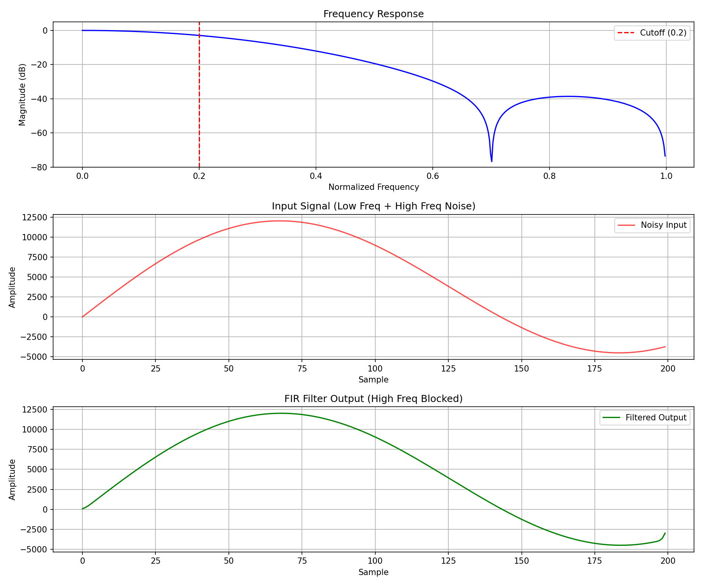

# fir-filter-vhdl-
# 8-Tap FIR Low-Pass Filter in VHDL

A fully simulated 8-tap FIR low-pass filter implemented in VHDL,
verified using GHDL and GTKWave with three independent test cases.
Designed as part of FPGA signal processing research work.

## Filter Specifications
| Parameter | Value |
|---|---|
| Filter Type | FIR, Linear Phase |
| Number of Taps | 8 |
| Window Function | Hamming |
| Cutoff Frequency | 0.2 × Nyquist |
| Coefficient Format | Q1.15 Fixed-Point (16-bit signed) |
| Input Width | 16-bit signed |
| Output Width | 34-bit signed (overflow-safe) |
| Clock Frequency | 100 MHz (10ns period) |

## Coefficients
Generated using Python `scipy.signal.firwin` with Hamming window:
[287, 1571, 5375, 9151, 9151, 5375, 1571, 287]
Symmetric coefficients confirm linear phase response.

## Architecture
The filter uses a classic MAC (Multiply-Accumulate) architecture:
- Shift register holds last N input samples
- Each sample multiplied by corresponding coefficient
- Results accumulated into output register
- Fully synchronous design with active-high reset
- Parameterised via VHDL generics (N_TAPS, COEFF_WIDTH, SAMPLE_WIDTH)

## Verification — 3 Test Cases

### Test 1: Impulse Response
Send a single sample of value 32767 followed by zeros.
Output should match scaled filter coefficients exactly.

Verified output sequence:
y[0] = 9,404,129   = 287  × 32767 ✅
y[1] = 51,476,957  = 1571 × 32767 ✅
y[2] = 176,122,625 = 5375 × 32767 ✅
y[3] = 299,850,817 = 9151 × 32767 ✅

### Test 2: Step Response
Input switches from 0 to constant value 1000.
Output ramps smoothly and settles — confirms filter stability.

### Test 3: Noisy Sine Wave
Input: equal mix of low frequency (0.05 normalised) 
       + high frequency interference (0.4 normalised)
Output: high frequency component blocked, low frequency passes cleanly.

## Results
| Metric | Value |
|---|---|
| SNR Improvement | 10.66 dB |
| Stopband Attenuation | 12.09 dB |
| Passband Ripple | < 1 dB |
| Impulse Response | Verified — matches coefficients exactly |
| Step Response | Stable — smooth ramp and settle |



## Repository Structure
```
fir-filter-vhdl/
├── src/
│   └── fir_filter.vhd
├── tb/
│   └── fir_filter_tb.vhd
├── scripts/
│   └── fir_coeffs.py
└── results/
    ├── fir_results.png
    ├── 1_impulse_response.png
    ├── 2_step_response.png
    └── 3_noisy_sine.png
```
## How to Simulate
### Requirements
- GHDL 0.37+
- GTKWave
- Python 3 + numpy + scipy + matplotlib

### Run
```bash
ghdl -a src/fir_filter.vhd
ghdl -a tb/fir_filter_tb.vhd
ghdl -e fir_filter_tb
ghdl -r fir_filter_tb --vcd=results/fir_filter.vcd --stop-time=3000ns
gtkwave results/fir_filter.vcd
```

### Generate Coefficients and Plots
```bash
python3 scripts/fir_coeffs.py
```

## Key Concepts Demonstrated
- Fixed-point arithmetic (Q1.15 format) in VHDL
- Synchronous design with clock-edge triggered processes
- Shift register based sample history
- Multiply-Accumulate (MAC) architecture
- FIR filter design using windowing method
- Digital signal processing verification methodology
- VHDL generics for parameterised, reusable design

## Tools
- **VHDL** — IEEE 1076 standard
- **GHDL 0.37** — open source VHDL simulator
- **GTKWave** — waveform viewer
- **Python 3** — scipy, numpy, matplotlib
- **OS** — Ubuntu 22.04 (WSL2)
